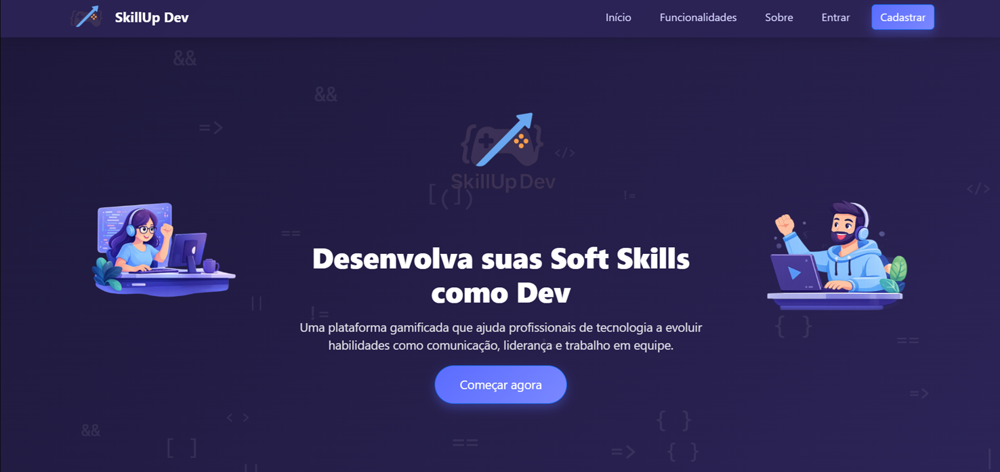
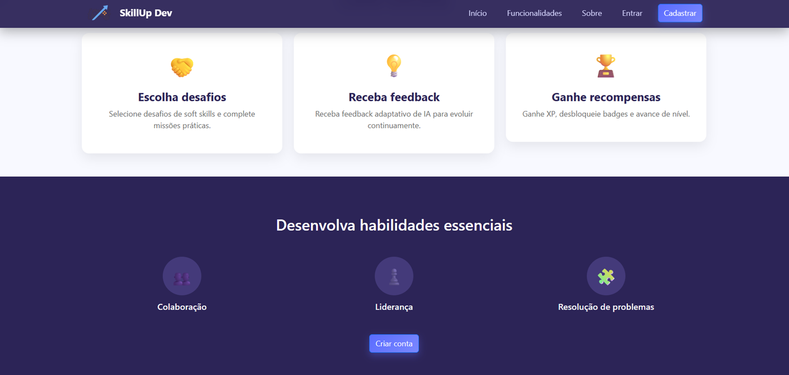
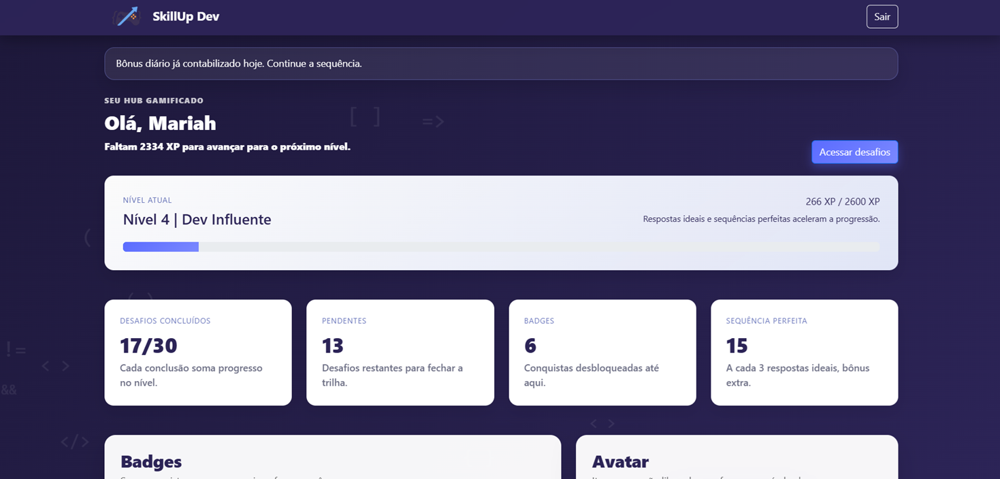
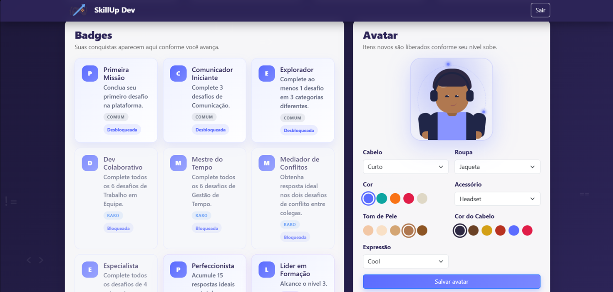
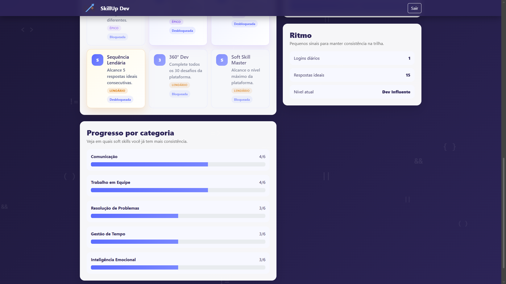
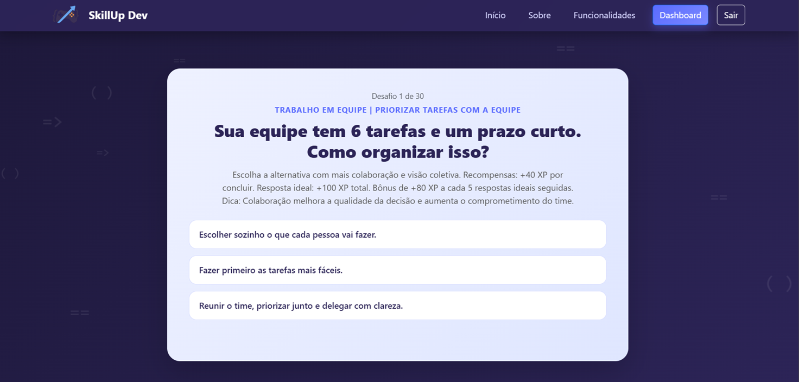
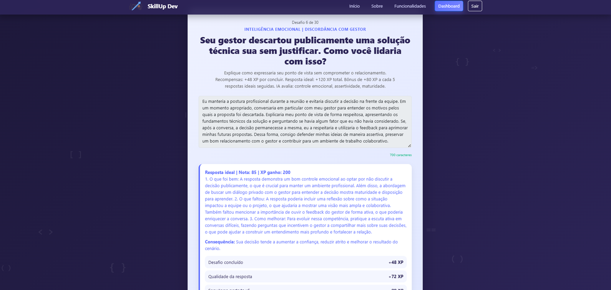
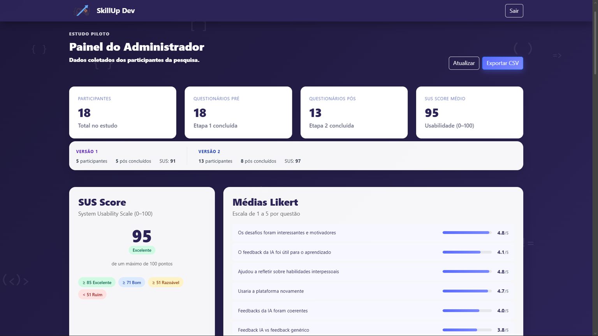

# 🚀 SkillUp Dev

Plataforma web gamificada voltada ao apromoramento de soft skills para desenvolvedores, com desafios interativos e feedback automatizado com apoio de IA.

       

## 📌 Sobre o projeto

O **SkillUp Dev** foi idealizado como um projeto acadêmico (TCC) no Centro Universitário de João Pessoa (UNIPÊ), com o objetivo de ajudar desenvolvedores a aprimorarem habilidades interpessoais essenciais para o mercado de trabalho.

A proposta da plataforma é proporcionar um ambiente interativo onde o usuário pode enfrentar situações do cotidiano profissional e receber feedbacks construtivos, promovendo aprendizado contínuo.

💡 Atualmente, segue com planos de evolução e expansão de funcionalidades após a conclusão da graduação.

## 🎯 Objetivo

Desenvolver uma solução digital que auxilie desenvolvedores a aprimorarem soft skills como:

* Comunicação
* Trabalho em equipe
* Resolução de problemas
* Pensamento crítico

## 💻 Tecnologias utilizadas

| Camada | Tecnologia |
|--------|------------|
| 🎨 Front-end | HTML5 • CSS3 • JavaScript |
| ⚙️ Back-end | Node.js • Express |
| 🤖 IA | OpenAI API (GPT-4o mini) |
| 🗄️ Banco de Dados | Upstash Redis (produção) • JSON local (dev) |
| ☁️ Hospedagem | Render |
| 📧 E-mail | Resend |
| 🔒 Segurança | Helmet • Express Rate Limit • CORS |

## 🚀 Funcionalidades

* 🎮 Desafios interativos simulando situações reais
* 🤖 Feedback automatizado com apoio de inteligência artificial
* 📊 Interface focada na experiência do usuário (UI/UX)
* 🌐 Navegação intuitiva e responsiva

## 📷 Preview

### 🏠 Tela inicial

### 📊 Dashboard

### 🎮 Desafios Multipla Esccolha

### 🎮 Desafios Dissertativos + 🤖 Feedback da IA

### 🖥️ Painel do Admin

## 📚 Validação Empírica - Estudo Piloto

| Dimensão avaliada | V1 | V2 | Variação |
| :--- | :---: | :---: | :---: |
| SUS Score Médio | 91,2 | 97,9 | **+6,7** |
| Desafios interessantes e motivadores | 4,4/5 | 5,0/5 | **+0,6** |
| Utilidade do feedback da IA | 2,8/5 | 5,0/5 | **+2,2** |
| Reflexão sobre soft skills | 4,6/5 | 5,0/5 | **+0,4** |
| Intenção de uso futuro | 4,2/5 | 5,0/5 | **+0,8** |
| Coerência percebida do feedback | 2,6/5 | 5,0/5 | **+2,4** |
| Diferenciação entre respostas genéricas | 2,6/5 | 4,9/5 | **+2,3** |

## 🔗 Acesso ao projeto

## 📈 Status do projeto

✅ Publicado e em desenvolvimento contínuo

Este projeto continuará sendo aprimorado após a conclusão do TCC, com foco em:

* Estudo empírico ampliado — amostras maiores, controle formal, acompanhamento longitudinal;
* Modelos de IA mais avançados para feedback ainda mais preciso;
* Expansão: trilhas de aprendizagem, histórico de feedbacks, novos módulos, integração com ambientes educacionais formais.

## 👩‍💻 Autores

* Maria Mariah Queiroga Fernandes Soares
* Weslley Batista Vasconcelos

## 🎓 Instituição

Centro Universitário de João Pessoa (UNIPÊ)
Trabalho de Conclusão de Curso – Ciência da Computação
2026
